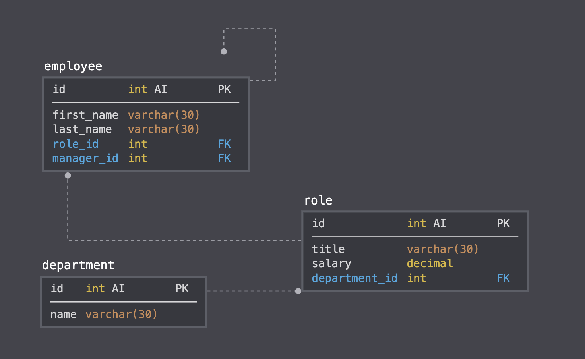

# Employee Tracker App

The Employee Tracker app is a solution for managing a company's employees using node, inquirer, and MySQL that satisfies the following user story:

```As a business owner
I want to be able to view and manage the departments, roles, and employees in my company
So that I can organize and plan my business
```


## Instructions

This app uses [MySQL](https://www.npmjs.com/package/mysql) and [InquirerJs](https://www.npmjs.com/package/inquirer/v/0.2.3). 

To Install, use the command `npm install`

Please enter your username and password in the index.js file where prompted.

To start, use the command `npm start`

A seed file has been provided in seed.sql which uses the below database schema.



## Mock-Up

The following video shows the functionality of the app.


## License

© 2021 Trilogy Education Services, LLC, a 2U, Inc. brand. Confidential and Proprietary. All Rights Reserved.

The MIT License (MIT) © 2021 Morgan Bailey